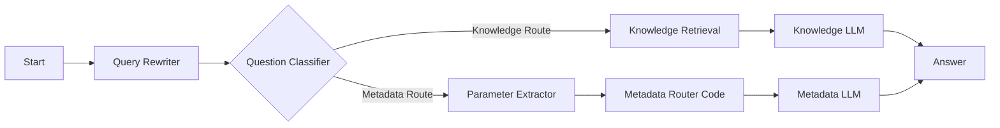
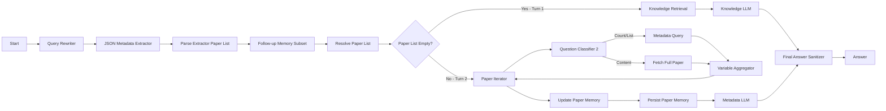

# RmapDifyChatbot

RmapDifyChatbot is a production-oriented Python project for operating a Dify-based
academic assistant with explicit metadata routing.

## Status Snapshot (2026-06-19)

1. Two-turn workflow validated end-to-end on all 6 Dieterich papers (Turn 1: 79 s, Turn 2: 214 s).
2. Turn 2 uses a single Metadata LLM call for all papers (Paper Map LLM removed from iteration).
3. `doc_id` is now propagated through the full Turn-1 → Turn-2 pipeline, eliminating O(N) title lookups.
4. Paper fetch reduced to 0.4–0.9 s/paper (was ~25 s/paper with title-based pagination).
5. Structured-output extractor handoff is robust; final answer sanitizer strips `<think>` leakage.

## Overview

The project has two responsibilities:

1. Main use-case: deploy and operate a metadata-aware Dify chatbot workflow.
2. Secondary service: extract metadata from papers and upload documents into Dify datasets.

Current routing workflow (`config/RMAP Chatbot Meta Routing.yml`):



Current iterative retrieval workflow (`config/RMAP Chatbot Iterative Retrieval.yml`):

20 nodes · 20 edges · Dify DSL v0.6.0 · `advanced-chat` mode



Key design decisions:
- **doc_id passthrough**: `conversation.memory` stores `doc_id` from Turn 1; `Follow-up Memory Subset` and `Resolve Paper List` preserve it so `Fetch Full Paper` can do a direct segment fetch without title lookup.
- **Single Metadata LLM call**: all paper texts are aggregated by the `Variable Aggregator` inside the iteration; one combined LLM call produces the synthesis and per-paper summaries.
- **Context budget**: `Fetch Full Paper` truncates each paper to 8 000 chars (~2 000 tokens); Metadata LLM uses `num_ctx=24576` and `max_tokens=4000`.

## Installation

### Requirements

1. Python 3.11+
2. Poetry

### Setup

```bash
poetry install
poetry run dify-upload --help
```

Optional local environment file (for import/debug scripts):

```bash
source .secrets/dify_console_session.env
```

Optional persistent login secrets (for `--auto-login`):

```bash
cat > .secrets/dify_console_login.env <<'EOF'
DIFY_CONSOLE_EMAIL="you@example.org"
# Option A (recommended): base64-encoded password string
DIFY_CONSOLE_PASSWORD_B64="<base64_password>"
# Option B (alternative): plaintext password
# DIFY_CONSOLE_PASSWORD="<plaintext_password>"
DIFY_CONSOLE_LOGIN_LANGUAGE="en-US"
DIFY_CONSOLE_REMEMBER_ME="true"
EOF
chmod 600 .secrets/dify_console_login.env
```

Notes:

1. Both `scripts/import_dify_dsl.sh` and `scripts/debug_route_draft.sh` auto-load `.secrets/dify_console_login.env` when present.
2. `.secrets/` is git-ignored in this repo, so this file is not committed.
3. Prefer `DIFY_CONSOLE_PASSWORD_B64`; it avoids shell quoting pitfalls but is not cryptographic protection.

### API credential map

Use different keys for different endpoint families:

1. `DIFY_APP_API_KEY` (prefix `app-`): app runtime endpoints under `/v1` (for example `/v1/chat-messages`, `/v1/meta`).
2. `DIFY_DATASET_API_KEY` (prefix `dataset-`): dataset upload/metadata endpoints under `/v1/datasets/...` used by `dify-upload`.
3. `DIFY_CONSOLE_API_KEY`: console-management endpoints under `/console/api/...` (workflow import, draft run).
4. Cookie fallback (`DIFY_CONSOLE_COOKIE` + `DIFY_CSRF_TOKEN`): only for deployments where console API keys are not accepted.

Notes:

1. The uploader currently supports `DIFY_API_KEY` as a backward-compatible alias for `DIFY_DATASET_API_KEY`.
2. In this deployment, app keys are valid for `/v1` but not for `/console/api`.

## Main Use-Case: Set Up The Meta Routing Chatbot

### 1. Import workflow DSL into Dify

Preferred mode (console API key):

```bash
DIFY_BASE_URL="http://your-dify-host" \
DIFY_CONSOLE_API_KEY="<console_api_key>" \
AUTO_CONFIRM=true \
scripts/import_dify_dsl.sh "config/RMAP Chatbot Meta Routing.yml" --app-id "<app_id>"
```

Cookie fallback (for deployments without console API key support):

```bash
DIFY_BASE_URL="http://your-dify-host" \
DIFY_CONSOLE_COOKIE="..." \
DIFY_CSRF_TOKEN="..." \
AUTO_CONFIRM=true \
scripts/import_dify_dsl.sh "config/RMAP Chatbot Meta Routing.yml" --app-id "<app_id>" --allow-cookie-auth
```

Auto-login (refresh short-lived console token via `/console/api/login`):

```bash
DIFY_BASE_URL="http://your-dify-host" \
DIFY_CONSOLE_EMAIL="you@example.org" \
DIFY_CONSOLE_PASSWORD_B64="<base64_password>" \
AUTO_CONFIRM=true \
scripts/import_dify_dsl.sh "config/RMAP Chatbot Meta Routing.yml" --app-id "<app_id>" --auto-login
```

### 2. Validate routing behavior

```bash
DIFY_BASE_URL="http://your-dify-host" \
DIFY_CONSOLE_COOKIE="..." \
DIFY_CSRF_TOKEN="..." \
scripts/debug_route_draft.sh \
	--app-id "<app_id>" \
	--allow-cookie-auth \
	--query "What are the main methods and findings of Sci-ModoM?" \
	--query "How many papers has Christoph Dieterich published?" \
	--query "Which papers have been (co-) authored by Christoph Dieterich?"
```

Or with console API key (if supported by your deployment):

```bash
DIFY_BASE_URL="http://your-dify-host" \
DIFY_CONSOLE_API_KEY="<console_api_key>" \
scripts/debug_route_draft.sh \
	--app-id "<app_id>" \
	--query "What are the main methods and findings of Sci-ModoM?"
```

Or with auto-login token refresh:

```bash
DIFY_BASE_URL="http://your-dify-host" \
DIFY_CONSOLE_EMAIL="you@example.org" \
DIFY_CONSOLE_PASSWORD_B64="<base64_password>" \
scripts/debug_route_draft.sh \
	--app-id "<app_id>" \
	--auto-login \
	--query "What are the main methods and findings of Sci-ModoM?"
```

Expected routes:

1. Content questions -> `Knowledge Route`
2. Count/list/filter questions -> `Metadata Route`

### 3. Cookie-free runtime check (`/v1`, app key)

Use this when you want to test the published app without console cookie/token handling.

```bash
DIFY_BASE_URL="http://your-dify-host" \
DIFY_APP_API_KEY="<app_key_with_app_prefix>" \
scripts/debug_route_runtime.sh \
	--query "Which papers have been (co-)authored by Christoph Dieterich?" \
	--query "Please summarize those papers."
```

Notes:

1. `scripts/debug_route_runtime.sh` uses `/v1/meta` and `/v1/chat-messages` with `Authorization: Bearer <app-key>`.
2. `/v1` executes the published app configuration, not the console draft.
3. Use `DIFY_APP_API_KEY` (recommended). `DIFY_API_KEY` is only used as a backward-compatible fallback variable.

## Main Use-Case: Iterative Map/Reduce Routing

Import the iterative workflow config:

```bash
DIFY_BASE_URL="http://your-dify-host" \
DIFY_CONSOLE_COOKIE="..." \
DIFY_CSRF_TOKEN="..." \
AUTO_CONFIRM=true \
scripts/import_dify_dsl.sh "config/RMAP Chatbot Iterative Retrieval.yml" --app-id "<app_id>" --allow-cookie-auth
```

Validate a two-turn handover (author list -> summarize previous papers):

```bash
DIFY_BASE_URL="http://your-dify-host" \
DIFY_CONSOLE_COOKIE="..." \
DIFY_CSRF_TOKEN="..." \
scripts/debug_route_draft.sh \
	--app-id "<app_id>" \
	--allow-cookie-auth \
	--classifier-node-id "17786780005730" \
	--query "What papers did Christoph Dieterich author?" \
	--query "Can you summarize these papers?"
```

Auto-login alternative for the same draft flow:

```bash
DIFY_BASE_URL="http://your-dify-host" \
DIFY_CONSOLE_EMAIL="you@example.org" \
DIFY_CONSOLE_PASSWORD_B64="<base64_password>" \
scripts/debug_route_draft.sh \
	--app-id "<app_id>" \
	--auto-login \
	--classifier-node-id "17786780005730" \
	--query "What papers did Christoph Dieterich author?" \
	--query "Can you summarize these papers?"
```

Notes:

1. `scripts/debug_route_draft.sh` now reuses `conversation_id` automatically across multiple `--query` values in one run.
2. You can also force a known conversation with `--conversation-id "<uuid>"`.
3. Iterative workflow now uses minimal memory handover: concrete paper entities from list queries are persisted in `conversation.memory` for follow-up summarize turns.
4. Memory fallback is only applied for follow-up style prompts (for example: "these papers", "Fasse mir diese Papiere zusammen") to avoid contaminating unrelated turns.
5. Hardened follow-up intents for map/reduce now include references like:
	- compare/contrast: "Compare these papers by methods and key findings"
	- ranking/subset: "Which one is the newest?", "top 3", "first two papers"
	- cross-lingual references: "diese Paper", "vergleiche diese", "welches davon"
6. Milestone 2026-05-21 (Map/Reduce follow-up hardening):
	- Resolve Paper List now performs deterministic subset selection from `conversation.memory` for `first/top/newest/oldest` follow-ups.
	- Restored missing iteration Code node (`17786780698570`) to keep graph edges consistent and avoid draft runtime `MISSING_NODE` errors.
	- Verified two-turn flow for `Which paper have been published by Christoph Dieterich` -> `Please summarize the first two papers.` returns successfully (HTTP 200) in draft run.
7. Milestone 2026-05-22 (Boss demo stabilization):
	- Split overloaded paper resolution logic into staged nodes (extractor parser, follow-up intent gate, memory subset selector, slim resolver merge) to make two-turn behavior explainable and robust.
	- Added final answer sanitization node (`1778800001013`) and routed the Answer node through `cleaned_text` to strip `<think>...</think>` leakage reliably.
	- Hardened reduce prompt with authoritative requested identities/order from resolver output to keep section 1/2 mapped to the requested first two papers.
	- Fixed YAML import fragility in single-quoted prompt blocks (apostrophe handling) and re-validated import success (HTTP 200).
	- Enforced deterministic fixed-subset formatting (`**1.` / `**2.` headers) even under sparse text context, so demo checks remain stable.
	- Re-tested two-turn draft flow (`author list` -> `summarize first two`) with HTTP 200 on both turns, no `<think>` in final answer, and both section markers present.

8. Milestone 2026-05-29 (structured-output and sanitizer hardening):
	- JSON Metadata Extractor switched to structured output as primary machine-readable contract.
	- Parser node updated to accept both `extractor_text` and `extractor_structured_output`, with structured output taking precedence.
	- Extractor max token budget increased to reduce truncation risk in larger author-paper lists.
	- Metadata LLM max token budget increased (`768 -> 1200`) to improve long-answer completeness.
	- Final sanitizer hardened for both closed and unclosed `<think>` segments.
	- Validated two-turn runs with HTTP 200 on both turns and no `<think>` content in final answer.

9. Milestone 2026-06-19 (Turn-2 consolidation — single LLM call + doc_id passthrough):
	- Removed `Paper Map LLM` node from inside the iteration (was 1 LLM call per paper).
	- `Fetch Full Paper` now returns `paper_context` (header + truncated text) directly to the `Variable Aggregator`.
	- A single `Metadata LLM` call outside the iteration synthesises all paper texts at once.
	- Fixed `_find_doc_id_by_title` O(N) pagination: uses `doc_metadata` field in the document list response (no per-document detail calls needed).
	- `doc_id` now propagates through the full pipeline: `conversation.memory` → `Follow-up Memory Subset` → `Resolve Paper List` → `Paper Iterator` item → `Fetch Full Paper`. `_clean_obj` in both code nodes updated to preserve `doc_id`.
	- Paper text limit reduced from 24 000 to 8 000 chars/paper; Metadata LLM `num_ctx` set to 24 576, `max_tokens` to 4 000.
	- `import_dify_dsl.sh` updated to always sync the Dify Draft after import (via `POST /workflows/draft`).
	- **Validated two-turn consolidation test (2026-06-19, app `16d50bee-bc86-4bda-bb56-a861743f3ddb`, draft run):**

| Turn | Query | Time |
|---|---|---|
| 1 | "Zeige mir alle Papiere von Christoph Dieterich in der Datenbank." | 79 s |
| 2 | "Fasse jedes dieser Papiere kurz zusammen." | 214 s |

Turn 1 — all 6 papers listed (Metadata Query path, IS_COUNT_OR_LIST):
```
Gesamtzahl der Publikationen: 6
1. APOBEC2 safeguards skeletal muscle cell fate ... | 2024 | PNAS
2. PEPseq quantifies transcriptome-wide changes ... | 2023 | Nucleic Acids Res
3. Detection of queuosine and queuosine precursors ... | 2023 | Nucleic Acids Res
4. Adaptive sampling for nanopore direct RNA-sequencing | 2023 | RNA
5. Detecting m6A at single-molecular resolution ... | 2024 | Nat Commun
6. Sci-ModoM: a quantitative database ... | 2025 | Nucleic Acids Res
```

Turn 2 — all 6 papers summarised (Fetch Full Paper path, IS_CONTENT):
- Fetch Full Paper ×6: **0.4–0.9 s/paper** (direct doc_id, no pagination)
- Metadata LLM: 15 260 prompt tokens · 1 388 completion tokens
- Output: global synthesis + 3-bullet-point summary per paper ✓

## Secondary Service: Metadata Extraction And Paper Upload

Use the CLI entrypoint:

```bash
poetry run dify-upload
```

If needed, provide dataset credentials via environment variables:

```bash
export DIFY_DATASET_API_KEY="dataset-..."
export DIFY_API_URL="http://your-dify-host/v1"
export DATASET_ID="<dataset_id>"
```

Common commands:

```bash
# Run default two-pass workflow
poetry run dify-upload default

# Run two-pass upload on one file
poetry run dify-upload two-pass --file "RMaP papers first funding period/your-file.pdf"

# Run diagnostics
poetry run dify-upload abc-test --file "RMaP papers first funding period/your-file.pdf"

# Preview extracted metadata
poetry run dify-upload metadata --file "RMaP papers first funding period/your-file.pdf"

# Process selected authors only
poetry run dify-upload selected-authors --author "Mark Helm" --author "Christoph Dieterich"

# Bulk processing
poetry run dify-upload bulk-two-pass --folder "RMaP papers first funding period"

# Quality report for extracted authors
poetry run dify-upload author-quality --folder "RMaP papers first funding period"
```

SLURM/GPU execution (recommended for full-folder runs with LLM fallback):

```bash
sbatch scripts/slurm_bulk_two_pass_ollama.sh
```

The SLURM script explicitly uses the Python module path to avoid wrapper ambiguity:

```bash
.venv/bin/python -m dify_uploader bulk-two-pass --folder "RMaP papers first funding period"
```

Hybrid extraction behavior in `dify_uploader/author_extraction.py`:

1. Fast regex and heuristics.
2. Optional LLM fallback via BAML for low-confidence cases.

BAML runtime example:

```bash
export BAML_OLLAMA_BASE_URL="http://app01.internal:21434/v1"
export BAML_OLLAMA_MODEL="qwen3:32b"
export AUTHOR_EXTRACTION_ENABLE_LLM_FALLBACK="true"
```

## Next Steps (Execution Plan)

1. Finish and verify the full 2-pass run for all PDFs in `RMaP papers first funding period` and capture success/failure counts in a run log.
2. Add a concise post-run summary artifact (processed files, retries, failures, elapsed time) under `reports/slurm/`.
3. Introduce a lightweight regression check for the two-turn path (`list papers` -> `summarize those papers`) after each workflow import.
4. Add a small acceptance checklist for stakeholder demos (HTTP status, sanitizer check, section mapping check).
