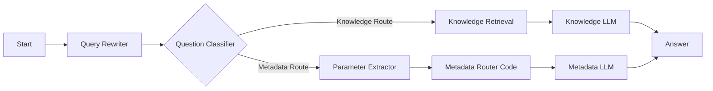
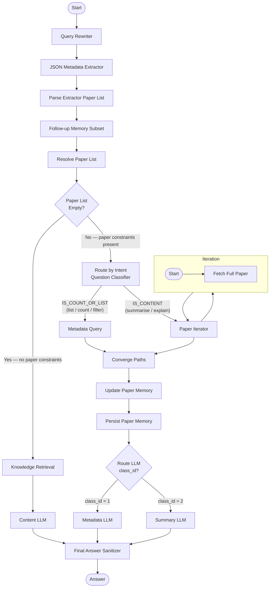

# RmapDifyChatbot

RmapDifyChatbot is a production-oriented Python project for operating a Dify-based
academic assistant with explicit metadata routing.

## Status Snapshot (2026-07-07)

**v0.4.1 — Prompt-Hardening & Metadata Sanitizer**

1. **3-LLM Intent Routing**: `Author Extraction LLM` (✅ stabil), `Entity Extraction LLM` (⚠️ redesigned), `KR Extraction LLM` (⚠️ header-guard).
2. **"Critical Reviews"-Bug behoben**: Entity Extraction nutzt nur noch "From paper:"-Header.
3. **Buchkapitel-Metadaten gefixt**: `_metadata_looks_garbled()` im Chunk-Filter erkennt defekte Dify-Metadaten.
4. **top_k: 50**: `TOP_K_MAX_VALUE=50` im Dify-Container.
5. **qwen2.5:14b**: Grounded, keine Paper-Halluzinationen.

## Overview

The project has two responsibilities:

1. Main use-case: deploy and operate a metadata-aware Dify chatbot workflow.
2. Secondary service: extract metadata from papers and upload documents into Dify datasets.

Current routing workflow (`config/RMAP Chatbot Meta Routing.yml`):



Current iterative retrieval workflow (`config/RMAP Chatbot Iterative Retrieval.yml`):

22 nodes · 23 edges · Dify DSL v0.6.0 · `advanced-chat` mode · model: `gpt-oss` (Ollama, 128k context)

### Architecture



### Node Reference

| # | Node | Type | Purpose |
|---|---|---|---|
| 1 | **Start** | start | Entry point — receives user query and conversation context. |
| 2 | **Query Rewriter** | llm | Rewrites the query to be self-contained, resolving pronouns and references (e.g. "these papers") using `conversation.memory`. |
| 3 | **JSON Metadata Extractor** | llm | Extracts structured paper constraints (title, authors, year, journal) from the rewritten query into JSON. |
| 4 | **Parse Extractor Paper List** | code | Parses the LLM's JSON output into a clean `array[object]`. Tolerates both free-text and structured-output formats. |
| 5 | **Follow-up Memory Subset** | code | Reads `conversation.memory` and returns the relevant subset (all, newest, oldest, top-N) based on intent keywords. |
| 6 | **Resolve Paper List** | code | Merges `memory_subset` and `extracted_paper_list` into the final `paper_list`, preserving `doc_id`. |
| 7 | **IF/ELSE** | if-else | Routes to Knowledge path if `paper_list` is empty, else to Route by Intent. |
| 8 | **Knowledge Retrieval** | knowledge-retrieval | Hybrid vector+keyword retrieval (top-10, 70/30 weighting) against the Dify dataset. |
| 9 | **Content LLM** | llm | Generates a grounded answer from retrieved knowledge chunks. |
| 10 | **Route by Intent** | question-classifier | Classifies the query as `IS_COUNT_OR_LIST` (listing/counting) or `IS_CONTENT` (summarise/explain). Sits **outside** the iterator. |
| 11 | **Metadata Query** | code | `IS_COUNT_OR_LIST` path. Receives the full `paper_list`, iterates internally, queries the dataset API by author/year/title metadata filters. Returns a formatted list. |
| 12 | **Paper Iterator** | iteration | `IS_CONTENT` path. Iterates over `paper_list` items. Each item carries `{title, authors, year, journal, doc_id}`. |
| 13 | **Fetch Full Paper** | code | Inside the iterator. Uses `doc_id` for a single-call segment fetch (0.4–0.9 s/paper). Dynamic text budget: `chars_per_paper = max(4 000, 48 000 // paper_count)`. |
| 14 | **Converge Paths** | code | Merges outputs from `Metadata Query` and `Iterator` — passes the non-empty result downstream. Ensures both paths flow through memory update. |
| 15 | **Update Paper Memory** | code | Parses the merged output into structured paper objects and deduplicates them. |
| 16 | **Persist Paper Memory** | assigner | Writes the updated paper list to `conversation.memory` (persisted across turns). |
| 17 | **Route LLM** | if-else | Checks the QC's `class_id`: routes `1` → Metadata LLM, `2` → Summary LLM. |
| 18 | **Metadata LLM** | llm | `IS_COUNT_OR_LIST` path. Clean listing: "Total count + numbered list (title, year, journal)". |
| 19 | **Summary LLM** | llm | `IS_CONTENT` path. Global synthesis (3–5 sentences) + 3 bullet points per paper (method/finding/implication). Strict grounding guard. |
| 20 | **Final Answer Sanitizer** | code | Strips `<think>` blocks from all three LLM outputs (Content/Metadata/Summary) and concatenates the non-empty one. |
| 21 | **Answer** | answer | Emits `cleaned_text` as the final conversational response. |

**Key design decisions**

- **QC outside the iterator**: The Question Classifier (`Route by Intent`) classifies the query **once** before any iteration. This avoids redundant per-paper classification and enables clean routing to either `Metadata Query` (no iteration needed) or `Paper Iterator` (only `Fetch Full Paper`).
- **Three separate LLMs**: Instead of one overloaded `Metadata LLM` handling both listing and summarisation, each path has a dedicated LLM with a focused prompt: `Content LLM` (knowledge retrieval), `Metadata LLM` (list/count), `Summary LLM` (synthesis + bullet points).
- **`doc_id` passthrough**: `conversation.memory` stores `doc_id` alongside each paper entry. `Follow-up Memory Subset` and `Resolve Paper List` preserve `doc_id`, so `Fetch Full Paper` can call the segments API directly — no pagination, no title matching.
- **Converge Paths → Memory update for both paths**: Both `Metadata Query` and `Iterator` outputs flow through `Converge Paths` → `Update Paper Memory` → `Persist Paper Memory`. This ensures the conversation memory is updated even for pure metadata queries, enabling correct follow-up turns.
- **Dynamic context budget**: `Resolve Paper List` outputs `paper_count`; `Fetch Full Paper` receives it and computes `chars_per_paper = max(4 000, 48 000 // paper_count)`. Total text budget fixed at 48 000 chars, distributed equally.

---

### Two-Turn Evaluation (2026-06-23)

**Setup:** Dify app `16d50bee-bc86-4bda-bb56-a861743f3ddb` · draft run via `scripts/debug_route_draft.sh` · model `gpt-oss` on Ollama

#### Turn 1 — List all papers by Christoph Dieterich

> **Query:** "Which papers have been authored by Christoph Dieterich"

**Route:** IF/ELSE (false: paper_list non-empty) → **Route by Intent** → Class `1` (IS_COUNT_OR_LIST) → **Metadata Query** → Converge Paths → Update Paper Memory → Persist Paper Memory → Route LLM (class_id=1) → **Metadata LLM**

**Answer:**
```
Total count: 6

1. APOBEC2 safeguards skeletal muscle cell fate through binding chromatin and regulating
   transcription of non-muscle genes during myoblast differentiation – 2024 – PNAS
2. PEPseq quantifies transcriptome-wide changes in protein occupancy and reveals selective
   translational repression after translational stress – 2023 – Nucleic Acids Res
3. Detection of queuosine and queuosine precursors in tRNAs by direct RNA sequencing
   – 2023 – Nucleic Acids Res
4. Adaptive sampling for nanopore direct RNA-sequencing – 2023 – RNA
5. Detecting m6A at single-molecular resolution via direct RNA sequencing and realistic
   training data – 2024 – Nat Commun
6. Sci-ModoM: a quantitative database of transcriptome-wide high-throughput RNA
   modification sites – 2025 – Nucleic Acids Res
```

#### Turn 2 — Summarise all six papers

> **Query:** "Please summarize them"

**Route:** IF/ELSE (false) → **Route by Intent** → Class `2` (IS_CONTENT) → **Paper Iterator** (Fetch Full Paper ×6) → Converge Paths → Update Paper Memory → Persist Paper Memory → Route LLM (class_id=2) → **Summary LLM**

**Answer:**

> **Global synthesis**
> These six papers collectively advance RNA biology by harnessing nanopore sequencing, innovative computational tools, and high-throughput profiling to interrogate RNA modifications, protein–RNA interactions, and transcriptome dynamics. [...]
>
> **1. APOBEC2 safeguards skeletal muscle cell fate …**
> - **Method:** Chromatin immunoprecipitation coupled with transcriptomic profiling in C2C12 cells; APOBEC2 knockdown experiments.
> - **Key finding:** APOBEC2 binds specific promoter motifs and recruits histone deacetylase complexes, repressing transcription of non-muscle lineage genes.
> - **Implication:** This activity safeguards muscle cell fate by preventing ectopic expression of alternative cell-type programs.
>
> [... 5 more papers with 3 bullet points each ...]

## Installation

### Requirements

1. Python 3.11+
2. Poetry

### Setup

```bash
poetry install
poetry run dify-upload --help
```

Optional local environment file (for import/debug scripts):

```bash
source .secrets/dify_console_session.env
```

Optional persistent login secrets (for `--auto-login`):

```bash
cat > .secrets/dify_console_login.env <<'EOF'
DIFY_CONSOLE_EMAIL="you@example.org"
# Option A (recommended): base64-encoded password string
DIFY_CONSOLE_PASSWORD_B64="<base64_password>"
# Option B (alternative): plaintext password
# DIFY_CONSOLE_PASSWORD="<plaintext_password>"
DIFY_CONSOLE_LOGIN_LANGUAGE="en-US"
DIFY_CONSOLE_REMEMBER_ME="true"
EOF
chmod 600 .secrets/dify_console_login.env
```

Notes:

1. Both `scripts/import_dify_dsl.sh` and `scripts/debug_route_draft.sh` auto-load `.secrets/dify_console_login.env` when present.
2. `.secrets/` is git-ignored in this repo, so this file is not committed.
3. Prefer `DIFY_CONSOLE_PASSWORD_B64`; it avoids shell quoting pitfalls but is not cryptographic protection.

### API credential map

Use different keys for different endpoint families:

1. `DIFY_APP_API_KEY` (prefix `app-`): app runtime endpoints under `/v1` (for example `/v1/chat-messages`, `/v1/meta`).
2. `DIFY_DATASET_API_KEY` (prefix `dataset-`): dataset upload/metadata endpoints under `/v1/datasets/...` used by `dify-upload`.
3. `DIFY_CONSOLE_API_KEY`: console-management endpoints under `/console/api/...` (workflow import, draft run).
4. Cookie fallback (`DIFY_CONSOLE_COOKIE` + `DIFY_CSRF_TOKEN`): only for deployments where console API keys are not accepted.

Notes:

1. The uploader currently supports `DIFY_API_KEY` as a backward-compatible alias for `DIFY_DATASET_API_KEY`.
2. In this deployment, app keys are valid for `/v1` but not for `/console/api`.

## Main Use-Case: Set Up The Meta Routing Chatbot

### 1. Import workflow DSL into Dify

Preferred mode (console API key):

```bash
DIFY_BASE_URL="http://your-dify-host" \
DIFY_CONSOLE_API_KEY="<console_api_key>" \
AUTO_CONFIRM=true \
scripts/import_dify_dsl.sh "config/RMAP Chatbot Meta Routing.yml" --app-id "<app_id>"
```

Cookie fallback (for deployments without console API key support):

```bash
DIFY_BASE_URL="http://your-dify-host" \
DIFY_CONSOLE_COOKIE="..." \
DIFY_CSRF_TOKEN="..." \
AUTO_CONFIRM=true \
scripts/import_dify_dsl.sh "config/RMAP Chatbot Meta Routing.yml" --app-id "<app_id>" --allow-cookie-auth
```

Auto-login (refresh short-lived console token via `/console/api/login`):

```bash
DIFY_BASE_URL="http://your-dify-host" \
DIFY_CONSOLE_EMAIL="you@example.org" \
DIFY_CONSOLE_PASSWORD_B64="<base64_password>" \
AUTO_CONFIRM=true \
scripts/import_dify_dsl.sh "config/RMAP Chatbot Meta Routing.yml" --app-id "<app_id>" --auto-login
```

### 2. Validate routing behavior

```bash
DIFY_BASE_URL="http://your-dify-host" \
DIFY_CONSOLE_COOKIE="..." \
DIFY_CSRF_TOKEN="..." \
scripts/debug_route_draft.sh \
	--app-id "<app_id>" \
	--allow-cookie-auth \
	--query "What are the main methods and findings of Sci-ModoM?" \
	--query "How many papers has Christoph Dieterich published?" \
	--query "Which papers have been (co-) authored by Christoph Dieterich?"
```

Or with console API key (if supported by your deployment):

```bash
DIFY_BASE_URL="http://your-dify-host" \
DIFY_CONSOLE_API_KEY="<console_api_key>" \
scripts/debug_route_draft.sh \
	--app-id "<app_id>" \
	--query "What are the main methods and findings of Sci-ModoM?"
```

Or with auto-login token refresh:

```bash
DIFY_BASE_URL="http://your-dify-host" \
DIFY_CONSOLE_EMAIL="you@example.org" \
DIFY_CONSOLE_PASSWORD_B64="<base64_password>" \
scripts/debug_route_draft.sh \
	--app-id "<app_id>" \
	--auto-login \
	--query "What are the main methods and findings of Sci-ModoM?"
```

Expected routes:

1. Content questions -> `Knowledge Route`
2. Count/list/filter questions -> `Metadata Route`

### 3. Cookie-free runtime check (`/v1`, app key)

Use this when you want to test the published app without console cookie/token handling.

```bash
DIFY_BASE_URL="http://your-dify-host" \
DIFY_APP_API_KEY="<app_key_with_app_prefix>" \
scripts/debug_route_runtime.sh \
	--query "Which papers have been (co-)authored by Christoph Dieterich?" \
	--query "Please summarize those papers."
```

Notes:

1. `scripts/debug_route_runtime.sh` uses `/v1/meta` and `/v1/chat-messages` with `Authorization: Bearer <app-key>`.
2. `/v1` executes the published app configuration, not the console draft.
3. Use `DIFY_APP_API_KEY` (recommended). `DIFY_API_KEY` is only used as a backward-compatible fallback variable.

## Main Use-Case: Iterative Retrieval Chatbot

Import the iterative workflow config (also syncs the Dify Draft automatically):

```bash
DIFY_BASE_URL="http://your-dify-host" \
DIFY_CONSOLE_COOKIE="..." \
DIFY_CSRF_TOKEN="..." \
AUTO_CONFIRM=true \
scripts/import_dify_dsl.sh "config/RMAP Chatbot Iterative Retrieval.yml" \
    --app-id "<app_id>" --allow-cookie-auth
```

Run the two-turn test against the draft (no publish required):

```bash
DIFY_BASE_URL="http://your-dify-host" \
DIFY_CONSOLE_COOKIE="..." \
DIFY_CSRF_TOKEN="..." \
scripts/debug_route_draft.sh \
    --app-id "<app_id>" \
    --allow-cookie-auth \
    --classifier-node-id "17786780005730" \
    --query "Zeige mir alle Papiere von Christoph Dieterich in der Datenbank." \
    --query "Fasse jedes dieser Papiere kurz zusammen."
```

Auto-login alternative:

```bash
DIFY_BASE_URL="http://your-dify-host" \
DIFY_CONSOLE_EMAIL="you@example.org" \
DIFY_CONSOLE_PASSWORD_B64="<base64_password>" \
scripts/debug_route_draft.sh \
    --app-id "<app_id>" \
    --auto-login \
    --classifier-node-id "17786780005730" \
    --query "Zeige mir alle Papiere von Christoph Dieterich in der Datenbank." \
    --query "Fasse jedes dieser Papiere kurz zusammen."
```

Notes:

1. `scripts/debug_route_draft.sh` runs against the Dify Draft via `POST /console/api/apps/{id}/advanced-chat/workflows/draft/run` — no publish step required.
2. `conversation_id` is reused automatically across multiple `--query` values in one run; use `--conversation-id "<uuid>"` to resume an existing conversation.
3. `conversation.memory` persists resolved paper entities (including `doc_id`) across turns so Turn-2 `Fetch Full Paper` can use direct segment lookup.
4. The `--classifier-node-id` flag extracts the routing decision from `Question Classifier 2` node events for debugging.

### Changelog

6. Milestone 2026-05-21 (Map/Reduce follow-up hardening):
	- Resolve Paper List now performs deterministic subset selection from `conversation.memory` for `first/top/newest/oldest` follow-ups.
	- Restored missing iteration Code node (`17786780698570`) to keep graph edges consistent and avoid draft runtime `MISSING_NODE` errors.
	- Verified two-turn flow for `Which paper have been published by Christoph Dieterich` -> `Please summarize the first two papers.` returns successfully (HTTP 200) in draft run.
7. Milestone 2026-05-22 (Boss demo stabilization):
	- Split overloaded paper resolution logic into staged nodes (extractor parser, follow-up intent gate, memory subset selector, slim resolver merge) to make two-turn behavior explainable and robust.
	- Added final answer sanitization node (`1778800001013`) and routed the Answer node through `cleaned_text` to strip `<think>...</think>` leakage reliably.
	- Hardened reduce prompt with authoritative requested identities/order from resolver output to keep section 1/2 mapped to the requested first two papers.
	- Fixed YAML import fragility in single-quoted prompt blocks (apostrophe handling) and re-validated import success (HTTP 200).
	- Enforced deterministic fixed-subset formatting (`**1.` / `**2.` headers) even under sparse text context, so demo checks remain stable.
	- Re-tested two-turn draft flow (`author list` -> `summarize first two`) with HTTP 200 on both turns, no `<think>` in final answer, and both section markers present.

8. Milestone 2026-05-29 (structured-output and sanitizer hardening):
	- JSON Metadata Extractor switched to structured output as primary machine-readable contract.
	- Parser node updated to accept both `extractor_text` and `extractor_structured_output`, with structured output taking precedence.
	- Extractor max token budget increased to reduce truncation risk in larger author-paper lists.
	- Metadata LLM max token budget increased (`768 -> 1200`) to improve long-answer completeness.
	- Final sanitizer hardened for both closed and unclosed `<think>` segments.
	- Validated two-turn runs with HTTP 200 on both turns and no `<think>` content in final answer.

10. Milestone 2026-06-19 (dynamic text budget for Fetch Full Paper):
	- `Resolve Paper List` now outputs `paper_count` (integer) alongside `paper_list`.
	- `Fetch Full Paper` accepts `paper_count` as an input variable and computes `chars_per_paper = max(4 000, 48 000 // paper_count)`.
	- Replaces the previous hard-coded 8 000 chars/paper limit; with fewer papers each paper gets proportionally more context.
	- **Verified:** 6-paper Turn-2 run: `paper_count=6` → 8 000 chars/paper, context lengths 8 161–8 456 chars, all 6 Fetch Full Paper nodes succeeded.

9. Milestone 2026-06-19 (Turn-2 consolidation — single LLM call + doc_id passthrough):
	- Removed `Paper Map LLM` node from inside the iteration (was 1 LLM call per paper).
	- `Fetch Full Paper` now returns `paper_context` (header + truncated text) directly to the `Variable Aggregator`.
	- A single `Metadata LLM` call outside the iteration synthesises all paper texts at once.
	- Fixed `_find_doc_id_by_title` O(N) pagination: uses `doc_metadata` field in the document list response (no per-document detail calls needed).
	- `doc_id` now propagates through the full pipeline: `conversation.memory` → `Follow-up Memory Subset` → `Resolve Paper List` → `Paper Iterator` item → `Fetch Full Paper`. `_clean_obj` in both code nodes updated to preserve `doc_id`.
	- Paper text limit reduced from 24 000 to 8 000 chars/paper; Metadata LLM `num_ctx` set to 24 576, `max_tokens` to 4 000.
	- `import_dify_dsl.sh` updated to always sync the Dify Draft after import (via `POST /workflows/draft`).
	- **Validated two-turn consolidation test (2026-06-19, app `16d50bee-bc86-4bda-bb56-a861743f3ddb`, draft run):**

| Turn | Query | Time |
|---|---|---|
| 1 | "Zeige mir alle Papiere von Christoph Dieterich in der Datenbank." | 79 s |
| 2 | "Fasse jedes dieser Papiere kurz zusammen." | 214 s |

Turn 1 — all 6 papers listed (Metadata Query path, IS_COUNT_OR_LIST):
```
Gesamtzahl der Publikationen: 6
1. APOBEC2 safeguards skeletal muscle cell fate ... | 2024 | PNAS
2. PEPseq quantifies transcriptome-wide changes ... | 2023 | Nucleic Acids Res
3. Detection of queuosine and queuosine precursors ... | 2023 | Nucleic Acids Res
4. Adaptive sampling for nanopore direct RNA-sequencing | 2023 | RNA
5. Detecting m6A at single-molecular resolution ... | 2024 | Nat Commun
6. Sci-ModoM: a quantitative database ... | 2025 | Nucleic Acids Res
```

Turn 2 — all 6 papers summarised (Fetch Full Paper path, IS_CONTENT):
- Fetch Full Paper ×6: **0.4–0.9 s/paper** (direct doc_id, no pagination)
- Metadata LLM: 15 260 prompt tokens · 1 388 completion tokens
- Output: global synthesis + 3-bullet-point summary per paper ✓

## Secondary Service: Metadata Extraction And Paper Upload

Use the CLI entrypoint:

```bash
poetry run dify-upload
```

If needed, provide dataset credentials via environment variables:

```bash
export DIFY_DATASET_API_KEY="dataset-..."
export DIFY_API_URL="http://your-dify-host/v1"
export DATASET_ID="<dataset_id>"
```

Common commands:

```bash
# Run default two-pass workflow
poetry run dify-upload default

# Run two-pass upload on one file
poetry run dify-upload two-pass --file "RMaP papers first funding period/your-file.pdf"

# Run diagnostics
poetry run dify-upload abc-test --file "RMaP papers first funding period/your-file.pdf"

# Preview extracted metadata
poetry run dify-upload metadata --file "RMaP papers first funding period/your-file.pdf"

# Process selected authors only
poetry run dify-upload selected-authors --author "Mark Helm" --author "Christoph Dieterich"

# Bulk processing
poetry run dify-upload bulk-two-pass --folder "RMaP papers first funding period"

# Quality report for extracted authors
poetry run dify-upload author-quality --folder "RMaP papers first funding period"
```

SLURM/GPU execution (recommended for full-folder runs with LLM fallback):

```bash
sbatch scripts/slurm_bulk_two_pass_ollama.sh
```

The SLURM script explicitly uses the Python module path to avoid wrapper ambiguity:

```bash
.venv/bin/python -m dify_uploader bulk-two-pass --folder "RMaP papers first funding period"
```

Hybrid extraction behavior in `dify_uploader/author_extraction.py`:

1. Fast regex and heuristics.
2. Optional LLM fallback via BAML for low-confidence cases.

BAML runtime example:

```bash
export BAML_OLLAMA_BASE_URL="http://app01.internal:21434/v1"
export BAML_OLLAMA_MODEL="qwen3:32b"
export AUTHOR_EXTRACTION_ENABLE_LLM_FALLBACK="true"
```

## Next Steps (Execution Plan)

1. Finish and verify the full 2-pass run for all PDFs in `RMaP papers first funding period` and capture success/failure counts in a run log.
2. Add a concise post-run summary artifact (processed files, retries, failures, elapsed time) under `reports/slurm/`.
3. Introduce a lightweight regression check for the two-turn path (`list papers` -> `summarize those papers`) after each workflow import.
4. Add a small acceptance checklist for stakeholder demos (HTTP status, sanitizer check, section mapping check).
