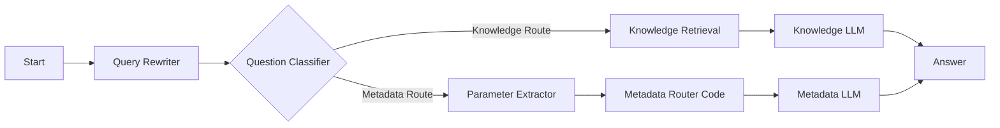

# RmapDifyChatbot

Tools and workflow definitions for:

- uploading and annotating papers in Dify datasets,
- metadata-first retrieval over academic papers,
- routing user queries between knowledge answers and metadata answers.

## Architecture

Current advanced-chat workflow (`config/RMAP Chatbot Meta Routing.yml`):



## Milestone

Routing milestone is tagged as `milestone-routing-stable-v1`.

Detailed release notes: `RELEASE_NOTES_milestone-routing-stable-v1.md`.

## Quick Start

```bash
poetry install
poetry run dify-upload --help
```

## Dify Import And Debug

### Preferred: API key

```bash
DIFY_BASE_URL="http://your-dify-host" \
DIFY_CONSOLE_API_KEY="<console_api_key>" \
AUTO_CONFIRM=true \
scripts/import_dify_dsl.sh "config/RMAP Chatbot Meta Routing.yml" --app-id "<app_id>"
```

### Cookie fallback (for deployments without console API key support)

```bash
DIFY_BASE_URL="http://your-dify-host" \
DIFY_CONSOLE_COOKIE="..." \
DIFY_CSRF_TOKEN="..." \
AUTO_CONFIRM=true \
scripts/import_dify_dsl.sh "config/RMAP Chatbot Meta Routing.yml" --app-id "<app_id>" --allow-cookie-auth
```

### Routing regression check

```bash
DIFY_BASE_URL="http://your-dify-host" \
DIFY_CONSOLE_COOKIE="..." \
DIFY_CSRF_TOKEN="..." \
scripts/debug_route_draft.sh \
	--app-id "<app_id>" \
	--allow-cookie-auth \
	--query "What are the main methods and findings of Sci-ModoM?" \
	--query "Wie viele Papiere hat Christoph Dieterich veroeffentlicht?" \
	--query "Which papers have been (co-) authored by Christoph Dieterich?"
```

Expected routing:

- content question -> `Knowledge Route`
- metadata count/list/filter questions -> `Metadata Route`

## CLI Commands

```bash
# Main entry point
poetry run dify-upload

# Default workflow
poetry run dify-upload default

# Two-pass upload
poetry run dify-upload two-pass --file "RMaP papers first funding period/your-file.pdf"

# A/B/C diagnostics
poetry run dify-upload abc-test --file "RMaP papers first funding period/your-file.pdf"

# Metadata preview
poetry run dify-upload metadata --file "RMaP papers first funding period/your-file.pdf"

# Selected authors workflow
poetry run dify-upload selected-authors

# Full bulk upload
poetry run dify-upload bulk-two-pass --folder "RMaP papers first funding period"

# Author quality report
poetry run dify-upload author-quality --folder "RMaP papers first funding period"
```

## Hybrid Author Extraction (Regex + BAML)

The extractor in `dify_uploader/author_extraction.py` uses a hybrid strategy:

1. Fast regex/heuristic extraction.
2. Automatic fallback to BAML structured output for low-confidence cases.

### BAML Runtime Setup

```bash
export BAML_OLLAMA_BASE_URL="http://127.0.0.1:11434/v1"
export BAML_OLLAMA_MODEL="qwen3:32b"
export AUTHOR_EXTRACTION_ENABLE_LLM_FALLBACK="true"
```

### Slurm Example

```bash
sbatch slurm/author-extraction-baml-qwen32.sbatch
```
