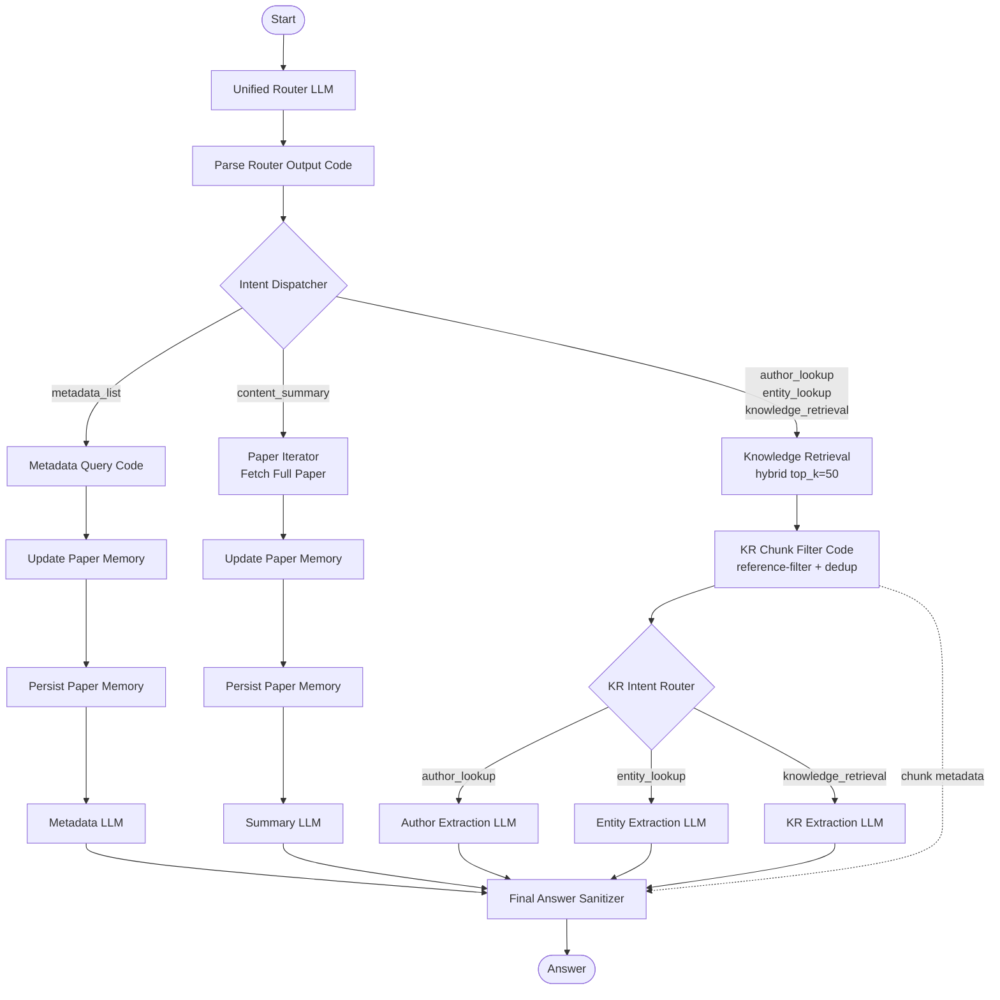

# RmapDifyChatbot

RmapDifyChatbot is a Dify-based academic literature assistant for the RMaP project. It answers questions about 84 RNA-modification papers using hybrid retrieval (keyword + vector) and intent-based routing.

## Status Snapshot (2026-07-09)

**v0.4.3 — PubMed-Metadaten & 3-LLM Intent Routing**

1. **5 Query-Intents**: `metadata_list`, `content_summary`, `knowledge_retrieval`, `author_lookup`, `entity_lookup`
2. **PubMed-Metadaten**: 83% der Papers (70/84) via DOI→PMID→MEDLINE – autoritative Titel, alle Autoren
3. **3-LLM Intent Routing**: `Author Extraction LLM`, `Entity Extraction LLM`, `KR Extraction LLM`
4. **top_k: 50**, Hybrid **0.7/0.3**, Model **qwen2.5:14b** (Ollama)
5. **22 Nodes, 27 Edges**

---

## Für Tester: Quick Start

### Zugang

| Variante | URL | Modus |
|---|---|---|
| **Published App** (stabil) | `http://rmap-chatbot-demo-dify.internal/chat/qSKbMGikJuIdhlfr` | Live-API, kein Debug |
| **Draft-Modus** (Preview) | Dify Console → App → "Preview" Tab | Debug-Output: Node-Status, Laufzeit |

Du bekommst eine Einladung zur Dify-Account-Erstellung. Nach dem Login findest du die App unter **Apps → RMAP Chatbot Iterative Retrieval**.

### Im Draft-Modus testen

1. App öffnen → Tab **"Preview"** (nicht "Published"!)
2. Query eingeben → der rechte Panel zeigt Workflow-Node-Status und Laufzeit
3. Bei Fehlern: den blauen/roten Node-Status checken – dort siehst du, welcher Node failed

### Erwartete Ergebnisse

| Intent | Beispiel-Query | Erwartet |
|---|---|---|
| `metadata_list` | "Papers by Christoph Dieterich" | 6 Papers aufgelistet |
| `content_summary` | "Summarize them" (nach metadata_list) | Global Synthesis + 3 Bullet Points/Paper |
| `knowledge_retrieval` | "What is m6A and detection methods?" | Methoden-Tabelle mit Inline-Citations |
| `author_lookup` | "Who has worked on tRNA modifications?" | ~7 Papers mit allen Autoren + Quotes |
| `entity_lookup` | "Which RNA modifications are most studied?" | ~6 Entity-Typen mit Paper-Zuordnung |

---

## Architektur



### Die 5 Intents im Detail

| Intent | Routing-Kriterium | Datenquelle | LLM | Prompt-Fokus |
|---|---|---|---|---|
| `metadata_list` | Autor/Titel/Journal-Filter | Dify Dataset API | Metadata LLM | "Total count + nummerierte Liste" |
| `content_summary` | Paper-Inhalte abrufen | Fetch Full Paper (Segments API) | Summary LLM | "Global Synthesis + 3 Bullets/Paper" |
| `knowledge_retrieval` | Allgemeine Wissensfrage | Hybrid Retrieval (top_k=50) | KR Extraction LLM | "Verbatim Quotes + Inline-Citations" |
| `author_lookup` | "Who has worked on X?" | Hybrid Retrieval + Chunk-Filter | Author Extraction LLM | "ALL authors + Quotes pro Paper" |
| `entity_lookup` | "Which X are studied?" | Hybrid Retrieval + Chunk-Filter | Entity Extraction LLM | "Entity-Tabelle mit Paper-Zuordnung" |

### Node Reference

| # | Node | Typ | Zweck |
|---|---|---|---|
| 1 | **Unified Router** | llm | Klassifiziert Intent, extrahiert Paper-Constraints, schreibt Query standalone |
| 2 | **Parse Router Output** | code | Parst JSON-Output des Routers, füllt `paper_list` aus `conversation.memory` bei Follow-up |
| 3 | **Intent Dispatcher** | if-else | 5-Branch Routing basierend auf `intent`-Feld |
| 4 | **Knowledge Retrieval** | knowledge-retrieval | Hybrid keyword (0.7) + vector (0.3), top_k=50, nomic-embed-text-v2-moe |
| 5 | **KR Chunk Filter** | code | Reference-List-Filter, 1 Chunk/Paper Dedup, Metadata-Garbling-Detection |
| 6 | **KR Intent Router** | if-else | Routet Chunks zu Author/Entity/KR Extraction LLM |
| 7 | **Author Extraction LLM** | llm | Extrahiert ALLE Autoren mit verbatim Quotes pro Paper |
| 8 | **Entity Extraction LLM** | llm | Extrahiert Entitäten (Modifikationen, Methoden, Organismen) als Tabelle |
| 9 | **KR Extraction LLM** | llm | Allgemeine Wissensfragen: Verbatim Quotes + Inline-Citations |
| 10 | **Metadata Query** | code | Durchsucht Dataset-API nach Author/Year/Title/Journal |
| 11 | **Paper Iterator** | iteration | Iteriert über `paper_list`, ruft Full-Text-Chunks ab |
| 12 | **Fetch Full Paper** | code | Holt Segments via Dify-API (0.4-0.9s/Paper), dynamisches Text-Budget |
| 13 | **Metadata LLM** | llm | `metadata_list`: "Total count + nummerierte Liste" |
| 14 | **Summary LLM** | llm | `content_summary`: "Global Synthesis + 3 Bullets/Paper" |
| 15 | **Final Answer Sanitizer** | code | Merged Outputs aller 5 Pfade, strippt `<think>`-Tags, reichert Autoren an |

## Technische Details

### Key Design Decisions

- **KR Query Rewriter entfernt** (v0.4.0): HyDE-style Keyword-Expansion matchte überproportional Bibliography-Sections. Query geht jetzt unverändert an KR.
- **qwen2.5:14b statt gpt-oss** (v0.4.0): Weniger Halluzination, strikteres Grounding.
- **1 Chunk/Paper** (v0.4.2): Maximiert Paper-Diversität im Context (bis 50 unique Papers).
- **top_k=50** (v0.4.0): `TOP_K_MAX_VALUE=50` im Dify-Container gesetzt – GUI-Limit umgangen.
- **PubMed-Metadaten** (v0.4.3): 83% Coverage via DOI→PMID→MEDLINE, keine LLM-Halluzination.

### Model Configuration

| LLM Node | Model | max_tokens | num_ctx | temp |
|---|---|---|---|---|
| Unified Router | qwen2.5:14b | 4096 | – | 0 |
| Author/Entity/KR Extraction | qwen2.5:14b | 4096 | 65536 | 0 |
| Metadata LLM | gpt-oss | 4000 | 24576 | 0 |
| Summary LLM | gpt-oss | 4000 | 65536 | 0 |

### Dataset

- **Name**: RMAP Papers
- **UUID**: `<your-dataset-id>`
- **Dokumente**: 84 Papers (RMaP First Funding Period)
- **Embedding**: nomic-embed-text-v2-moe (Ollama)
- **Chunking**: Dify Standard (automatic mode)

## Repository Structure

```
rmap-chatbot/
├── config/                     # Dify DSL YAML files
│   └── RMAP Chatbot Iterative Retrieval.yml
├── workflow_scripts/           # Code-Node Python-Quellen (vom Build-Prozess injected)
├── scripts/                    # Import/Export/Debug-Skripte
│   ├── import_dify_dsl.sh      # Import + KR-Dataset-Auto-Fix
│   ├── export_dify_dsl.sh      # Export + KR-Dataset-Patch
│   └── debug_route_draft.sh    # Draft-Modus Test-Runner
├── dify_uploader/              # CLI für Paper-Upload & Metadaten-Extraktion
└── .secrets/                   # Credentials (git-ignored)
```

## Development Workflow

```bash
# 1. Änderungen in Dify UI machen
# 2. DSL exportieren
bash scripts/export_dify_dsl.sh "config/RMAP Chatbot Iterative Retrieval.yml" --auto-login

# 3. In Dify UI: Draft testen via Preview-Tab

# 4. Bei Erfolg: DSL committen & per Import deployen
bash scripts/import_dify_dsl.sh "config/RMAP Chatbot Iterative Retrieval.yml" --allow-cookie-auth --auto-login

# 5. Draft via debug_route testen
bash scripts/debug_route_draft.sh --app-id "16d50bee-..." --classifier-node-id "1778800001032" \
  --query "What is m6A?" --allow-cookie-auth --auto-login
