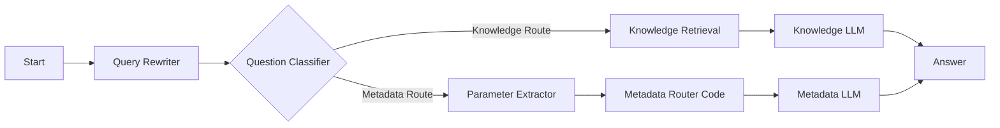
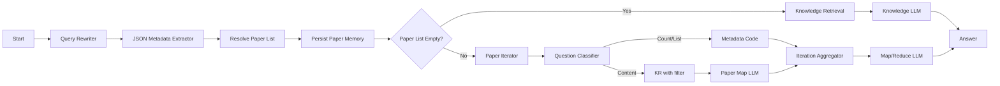

# RmapDifyChatbot

RmapDifyChatbot is a production-oriented Python project for operating a Dify-based
academic assistant with explicit metadata routing.

## Overview

The project has two responsibilities:

1. Main use-case: deploy and operate a metadata-aware Dify chatbot workflow.
2. Secondary service: extract metadata from papers and upload documents into Dify datasets.

Current routing workflow (`config/RMAP Chatbot Meta Routing.yml`):



Planned iterative retrieval workflow (`config/RMAP Chatbot Iterative Retrieval.yml`):



## Installation

### Requirements

1. Python 3.11+
2. Poetry

### Setup

```bash
poetry install
poetry run dify-upload --help
```

Optional local environment file (for import/debug scripts):

```bash
source .secrets/dify_console_session.env
```

### API credential map

Use different keys for different endpoint families:

1. `DIFY_APP_API_KEY` (prefix `app-`): app runtime endpoints under `/v1` (for example `/v1/chat-messages`, `/v1/meta`).
2. `DIFY_DATASET_API_KEY` (prefix `dataset-`): dataset upload/metadata endpoints under `/v1/datasets/...` used by `dify-upload`.
3. `DIFY_CONSOLE_API_KEY`: console-management endpoints under `/console/api/...` (workflow import, draft run).
4. Cookie fallback (`DIFY_CONSOLE_COOKIE` + `DIFY_CSRF_TOKEN`): only for deployments where console API keys are not accepted.

Notes:

1. The uploader currently supports `DIFY_API_KEY` as a backward-compatible alias for `DIFY_DATASET_API_KEY`.
2. In this deployment, app keys are valid for `/v1` but not for `/console/api`.

## Main Use-Case: Set Up The Meta Routing Chatbot

### 1. Import workflow DSL into Dify

Preferred mode (console API key):

```bash
DIFY_BASE_URL="http://your-dify-host" \
DIFY_CONSOLE_API_KEY="<console_api_key>" \
AUTO_CONFIRM=true \
scripts/import_dify_dsl.sh "config/RMAP Chatbot Meta Routing.yml" --app-id "<app_id>"
```

Cookie fallback (for deployments without console API key support):

```bash
DIFY_BASE_URL="http://your-dify-host" \
DIFY_CONSOLE_COOKIE="..." \
DIFY_CSRF_TOKEN="..." \
AUTO_CONFIRM=true \
scripts/import_dify_dsl.sh "config/RMAP Chatbot Meta Routing.yml" --app-id "<app_id>" --allow-cookie-auth
```

### 2. Validate routing behavior

```bash
DIFY_BASE_URL="http://your-dify-host" \
DIFY_CONSOLE_COOKIE="..." \
DIFY_CSRF_TOKEN="..." \
scripts/debug_route_draft.sh \
	--app-id "<app_id>" \
	--allow-cookie-auth \
	--query "What are the main methods and findings of Sci-ModoM?" \
	--query "How many papers has Christoph Dieterich published?" \
	--query "Which papers have been (co-) authored by Christoph Dieterich?"
```

Or with console API key (if supported by your deployment):

```bash
DIFY_BASE_URL="http://your-dify-host" \
DIFY_CONSOLE_API_KEY="<console_api_key>" \
scripts/debug_route_draft.sh \
	--app-id "<app_id>" \
	--query "What are the main methods and findings of Sci-ModoM?"
```

Expected routes:

1. Content questions -> `Knowledge Route`
2. Count/list/filter questions -> `Metadata Route`

## Planned Use-Case: Iterative Map/Reduce Routing

Import the iterative workflow config:

```bash
DIFY_BASE_URL="http://your-dify-host" \
DIFY_CONSOLE_COOKIE="..." \
DIFY_CSRF_TOKEN="..." \
AUTO_CONFIRM=true \
scripts/import_dify_dsl.sh "config/RMAP Chatbot Iterative Retrieval.yml" --app-id "<app_id>" --allow-cookie-auth
```

Validate a two-turn handover (author list -> summarize previous papers):

```bash
DIFY_BASE_URL="http://your-dify-host" \
DIFY_CONSOLE_COOKIE="..." \
DIFY_CSRF_TOKEN="..." \
scripts/debug_route_draft.sh \
	--app-id "<app_id>" \
	--allow-cookie-auth \
	--classifier-node-id "17786780005730" \
	--query "What papers did Christoph Dieterich author?" \
	--query "Can you summarize these papers?"
```

Notes:

1. `scripts/debug_route_draft.sh` now reuses `conversation_id` automatically across multiple `--query` values in one run.
2. You can also force a known conversation with `--conversation-id "<uuid>"`.
3. Conversation variable `conversation.memory` stores resolved metadata constraints for cross-turn map/reduce routing.

## Secondary Service: Metadata Extraction And Paper Upload

Use the CLI entrypoint:

```bash
poetry run dify-upload
```

If needed, provide dataset credentials via environment variables:

```bash
export DIFY_DATASET_API_KEY="dataset-..."
export DIFY_API_URL="http://your-dify-host/v1"
export DATASET_ID="<dataset_id>"
```

Common commands:

```bash
# Run default two-pass workflow
poetry run dify-upload default

# Run two-pass upload on one file
poetry run dify-upload two-pass --file "RMaP papers first funding period/your-file.pdf"

# Run diagnostics
poetry run dify-upload abc-test --file "RMaP papers first funding period/your-file.pdf"

# Preview extracted metadata
poetry run dify-upload metadata --file "RMaP papers first funding period/your-file.pdf"

# Process selected authors only
poetry run dify-upload selected-authors --author "Mark Helm" --author "Christoph Dieterich"

# Bulk processing
poetry run dify-upload bulk-two-pass --folder "RMaP papers first funding period"

# Quality report for extracted authors
poetry run dify-upload author-quality --folder "RMaP papers first funding period"
```

Hybrid extraction behavior in `dify_uploader/author_extraction.py`:

1. Fast regex and heuristics.
2. Optional LLM fallback via BAML for low-confidence cases.

BAML runtime example:

```bash
export BAML_OLLAMA_BASE_URL="http://127.0.0.1:11434/v1"
export BAML_OLLAMA_MODEL="qwen3:32b"
export AUTHOR_EXTRACTION_ENABLE_LLM_FALLBACK="true"
```
