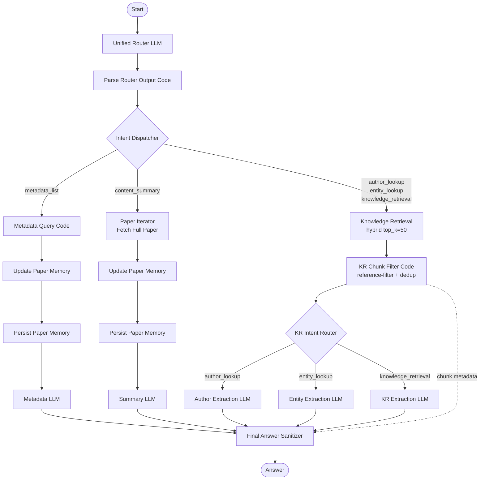

# RmapDifyChatbot

RmapDifyChatbot is a Dify-based academic literature assistant for the RMaP project. It answers questions about 84 RNA-modification papers using hybrid retrieval (keyword + vector) and intent-based routing.

## Status Snapshot (2026-07-28)

**v0.4.16 — EU AI Act Art. 50 Compliant 🇪🇺**

1. **5 Query Intents + Collaboration**: ✅ `metadata_list`, `content_summary`, `knowledge_retrieval`, `author_lookup`, `entity_lookup` + 🆕 Co-Author Analysis
2. **84 Papers** in dataset, all with PubMed/CrossRef metadata
3. **All Prompt Fixes** (v0.4.6–v0.4.16): Quote, Count, Group-by, Find-by-name, Citation, Cross-Contamination, HEK, Name-Format, Author-Display, Umlaut, Multi-Author-OR+LLM-Bypass, Two-Turn-Memory, Code-Guard, Collaboration, EU AI Act
4. **top_k: 100**, Hybrid **0.7/0.3**, **qwen2.5:14b** (A2 16GB VRAM), 23 Nodes, 28 Edges
5. **20 Test Cases**: ✅ 19 · ⚠️ 2 · ❌ 0 (Regression 2026-07-29)
6. **EU AI Act Art. 50 Compliant 🇪🇺**: Opening statement (Art. 50(1)) + machine-readable watermark `<!-- AI_GENERATED_CONTENT_RMAP -->` on all AI-generated text (Art. 50(2))

---

## For Testers: Quick Start

### Access

| Variant | URL | Mode |
|---|---|---|
| **Published App** (stable) | `http://<your-dify-host>/chat/<your-chat-url-token>` | Live API, no debug |
| **Draft Mode** (Preview) | Dify Console → App → "Preview" tab | Debug output: node status, runtime |

You will receive an invitation to create a Dify account. After login, find the app under **Apps → RMAP Chatbot Iterative Retrieval**.

### Testing in Draft Mode

1. Open the app → **"Preview"** tab (not "Published"!)
2. Enter a query → the right panel shows workflow node status and runtime
3. On errors: check the blue/red node status — shows which node failed

### Expected Results

| Intent | Example Query | Expected | Known Limitation |
|---|---|---|---|
| `metadata_list` | "Papers by Christoph Dieterich" | 8 papers listed | – |
| `metadata_list` | "Find all research papers" | 81 papers (LLM-native, no regex) | – |
| `metadata_list` | "List all researchers" | 776 authors (LLM-native) | – |
| `metadata_list` | "Who has collaborated with X?" | Co-author pairs for X | – |
| `content_summary` | "Summarize them" (after metadata_list) | Global Synthesis + 3 bullet points/paper | Max 8 papers (A2 latency limit, v0.4.10) |
| `knowledge_retrieval` | "What is m6A?" | Methods with inline citations | ✅ Citations verified (v0.4.7) |
| `author_lookup` | "Who has worked on tRNA modifications?" | ~9 papers with authors + quotes | ✅ Quotes + Authors verified (v0.4.7) |
| `entity_lookup` | "Which RNA modifications are most studied?" | ~5 entity types with paper references | ⚠️ m6A missing (14B limit, needs 32B) |

→ Detailed test results: [`docs/test-cases.md`](docs/test-cases.md)

---

## Architecture


```mermaid
flowchart TD
    Start([Start]) --> UR[Unified Router LLM]
    UR --> PRO[Parse Router Output Code]
    PRO --> ID{Intent Dispatcher}

    ID -->|metadata_list| MQ[Metadata Query Code]
    ID -->|content_summary| IT["Paper Iterator\nFetch Full Paper"]
    ID -->|author_lookup<br/>entity_lookup<br/>knowledge_retrieval| KR[Knowledge Retrieval\nhybrid top_k=50]

    MQ --> UPM1[Update Paper Memory]
    IT --> UPM2[Update Paper Memory]
    UPM1 --> PPM1[Persist Paper Memory]
    UPM2 --> PPM2[Persist Paper Memory]
    PPM1 --> MLLM[Metadata LLM]
    PPM2 --> SLLM[Summary LLM]

    KR --> KRF[KR Chunk Filter Code\nreference-filter + dedup]
    KRF --> KIR{KR Intent Router}

    KIR -->|author_lookup| AEL[Author Extraction LLM]
    KIR -->|entity_lookup| EEL[Entity Extraction LLM]
    KIR -->|knowledge_retrieval| KEL[KR Extraction LLM]

    MLLM --> SAN[Final Answer Sanitizer]
    SLLM --> SAN
    AEL --> SAN
    EEL --> SAN
    KEL --> SAN
    KRF -.->|chunk metadata| SAN

    SAN --> ANS([Answer])
```

### The 5 Intents in Detail

| Intent | Routing Criterion | Data Source | LLM | Prompt Focus |
|---|---|---|---|---|
| `metadata_list` | Author/title/journal filter | Dify Dataset API | Metadata LLM | "Total count + numbered list" |
| `content_summary` | Retrieve paper content | Fetch Full Paper (Segments API) | Summary LLM | "Global Synthesis + 3 bullets/paper" |
| `knowledge_retrieval` | General knowledge question | Hybrid Retrieval (top_k=50) | KR Extraction LLM | "Verbatim quotes + inline citations" |
| `author_lookup` | "Who has worked on X?" | Hybrid Retrieval + Chunk Filter | Author Extraction LLM | "ALL authors + quotes per paper" |
| `entity_lookup` | "Which X are studied?" | Hybrid Retrieval + Chunk Filter | Entity Extraction LLM | "Entity table with paper references" |

### Node Reference

| # | Node | Type | Purpose |
|---|---|---|---|
| 1 | **Unified Router** | llm | Classifies intent, extracts paper constraints, writes standalone query |
| 2 | **Parse Router Output** | code | Parses router JSON output, reads `list_mode` (papers/authors) from LLM JSON, auto-fallback `conversation.memory` for `content_summary` only |
| 3 | **Intent Dispatcher** | if-else | 5-branch routing based on `intent` field |
| 4 | **Knowledge Retrieval** | knowledge-retrieval | Hybrid keyword (0.7) + vector (0.3), top_k=50, nomic-embed-text-v2-moe |
| 5 | **KR Chunk Filter** | code | Reference list filter, 1 chunk/paper dedup, metadata garbling detection, 30-element cap |
| 6 | **KR Intent Router** | if-else | Routes chunks to Author/Entity/KR Extraction LLM |
| 7 | **Author Extraction LLM** | llm | Extracts ALL authors with verbatim quotes per paper |
| 8 | **Entity Extraction LLM** | llm | Extracts entities (modifications, methods, organisms) as table |
| 9 | **KR Extraction LLM** | llm | General knowledge questions: verbatim quotes + inline citations |
| 10 | **Metadata Query** | code | Queries Dataset API by author/year/title/journal; `list_mode` controls papers vs. authors extraction |
| 11 | **Paper Iterator** | iteration | Iterates over `paper_list`, fetches full-text chunks |
| 12 | **Fetch Full Paper** | code | Retrieves segments via Dify API (0.4–0.9s/paper), dynamic text budget |
| 13 | **Metadata LLM** | llm | `metadata_list`: "Total count + numbered list" |
| 14 | **Summary LLM** | llm | `content_summary`: "Global Synthesis + 3 bullets/paper" |
| 15 | **Final Answer Sanitizer** | code | Merges outputs from all 5 paths, strips `<think>` tags, enriches authors, appends EU AI Act watermark |

## Technical Details

### Key Design Decisions

- **Regex-free Broad Query Routing** (v0.4.6): Unified Router LLM natively handles "Find all papers" and "List all researchers" via `list_mode` field. 24 lines of regex patterns removed from `parse_router_output.py`.
- **MAX_PAPERS_FOR_SUMMARY = 8** (v0.4.10): Prevents timeout (>5 min) on A2 for authors with many papers. Reduced 15→8, tested at 194s for Mark Helm (28 papers).
- **KR Query Rewriter Removed** (v0.4.0): HyDE-style keyword expansion disproportionately matched bibliography sections. Query now passes through unchanged to KR.
- **qwen2.5:14b for All LLMs** (v0.4.6): `gpt-oss` fully replaced — less hallucination, stricter grounding.
- **1 Chunk/Paper** (v0.4.2): Maximizes paper diversity in context (up to 50 unique papers).
- **top_k=100** (v0.4.7): `TOP_K_MAX_VALUE=100` set in Dify container — bypasses GUI limit.
- **PubMed Metadata** (v0.4.3→v0.4.10): 100% coverage via DOI→PMID→MEDLINE + CrossRef + LLM (qwen3:32b). No LLM hallucination in metadata.

### Model Configuration

| LLM Node | Model | max_tokens | num_ctx | temp |
|---|---|---|---|---|
| Unified Router | qwen2.5:14b | 4096 | – | 0 |
| Author/Entity/KR Extraction | qwen2.5:14b | 4096 | 65536 | 0 |
| Metadata LLM | qwen2.5:14b | 4000 | 32768 | 0 |
| Summary LLM | qwen2.5:14b | 4000 | 65536 | 0 |

> All LLM nodes now use `qwen2.5:14b` (Ollama). `gpt-oss` was fully replaced in v0.4.6.

### Dataset

- **Name**: RMAP Papers
- **UUID**: `<your-dataset-id>`
- **Documents**: 84 papers (RMaP First Funding Period), all with PubMed/CrossRef metadata
- **Embedding**: nomic-embed-text-v2-moe (Ollama)
- **Chunking**: Dify standard (automatic mode)

## Known Issues

| # | Intent | Problem | Severity | Details |
|---|--------|---------|----------|---------|
| 1 | `entity_lookup` | Recall limit | ⚠️ Medium | Only 5 entities. m6A missing. qwen2.5:14b intrinsically stops at ~6 entities. Fix requires 32B upgrade (P3). |
| 2 | `content_summary` | Mark Helm timeout | ✅ Fixed (v0.4.10) | Cap 15→8: 194s instead of >5 min timeout. |
| 3 | `knowledge_retrieval` | miCLIP/MeRIP gap | ⚠️ Low | Embedding model limit: nomic doesn't map "detection methods" to miCLIP/MeRIP chunks. Hybrid weights tested (0.1–0.9), no effect. bge-m3 evaluated (same quality, 48% slower). |

→ Detailed analysis: [`docs/test-cases.md`](docs/test-cases.md)

## Repository Structure

```
rmap-chatbot/
├── config/                     # Dify DSL YAML files
│   └── RMAP Chatbot Iterative Retrieval.yml
├── workflow_scripts/           # Code node Python sources (injected by build process)
├── scripts/                    # Import/export/debug scripts
│   ├── import_dify_dsl.sh      # Import + KR dataset auto-fix
│   ├── export_dify_dsl.sh      # Export + KR dataset patch
│   └── debug_route_draft.sh    # Draft mode test runner
├── dify_uploader/              # CLI for paper upload & metadata extraction
├── .env                        # All secrets & configuration (git-ignored)
├── .env.example                # Template without real keys (committed)
└── .secrets/                   # Runtime session tokens (git-ignored)
```

## Development Workflow

```bash
# 1. Make changes (code in workflow_scripts/ or prompts in Dify UI)

# 2a. If changed Dify UI: export DSL
bash scripts/export_dify_dsl.sh "config/RMAP Chatbot Iterative Retrieval.yml" --auto-login
# 2b. If changed workflow_scripts/: nothing needed (build step handles it)

# 3. Deploy — one command does it all:
#    build → sanitize → import → env inject → KR fix → draft sync
bash scripts/import_dify_dsl.sh "config/RMAP Chatbot Iterative Retrieval.yml" --allow-cookie-auth --auto-login

# 4. Publish (draft already has real env vars from step 3)
python3 -c "
import requests, os
with open('.env') as f:
    env = {}
    for line in f:
        if '=' in line and not line.startswith('#'): k,v = line.split('=',1); env[k.strip()]=v.strip().strip('\"')
with open('.secrets/dify_console_session.env') as f:
    for line in f:
        if '=' in line and not line.startswith('#'): k,v = line.split('=',1); env[k.strip()]=v.strip().strip('\"')
r = requests.get(f'{env[\"DIFY_BASE_URL\"]}/console/api/apps/16d50bee-bc86-4bda-bb56-a861743f3ddb/workflows/draft',
    headers={'Cookie': env['DIFY_CONSOLE_COOKIE'], 'x-csrf-token': env['DIFY_CSRF_TOKEN']})
d = r.json()
requests.post(f'{env[\"DIFY_BASE_URL\"]}/console/api/apps/16d50bee-bc86-4bda-bb56-a861743f3ddb/workflows/publish',
    headers={'Cookie': env['DIFY_CONSOLE_COOKIE'], 'x-csrf-token': env['DIFY_CSRF_TOKEN'], 'Content-Type': 'application/json'},
    json={'graph': d['graph'], 'features': d.get('features',{}), 'environment_variables': d.get('environment_variables',[]),
          'conversation_variables': d.get('conversation_variables',[]), 'hash': d.get('hash','')})
print('Published')
"

# 5. Quick smoke test
DIFY_BASE_URL="http://rmap-chatbot-demo-dify" DIFY_APP_API_KEY="app-..." \
  bash scripts/debug_route_runtime.sh --query "Papers by Christoph Dieterich"
```

> **Key rule:** `.env` is the single source of truth. The YAML only contains placeholders. `import_dify_dsl.sh` auto-injects real values from `.env` on every run. Never manually edit env vars in the Dify UI.
